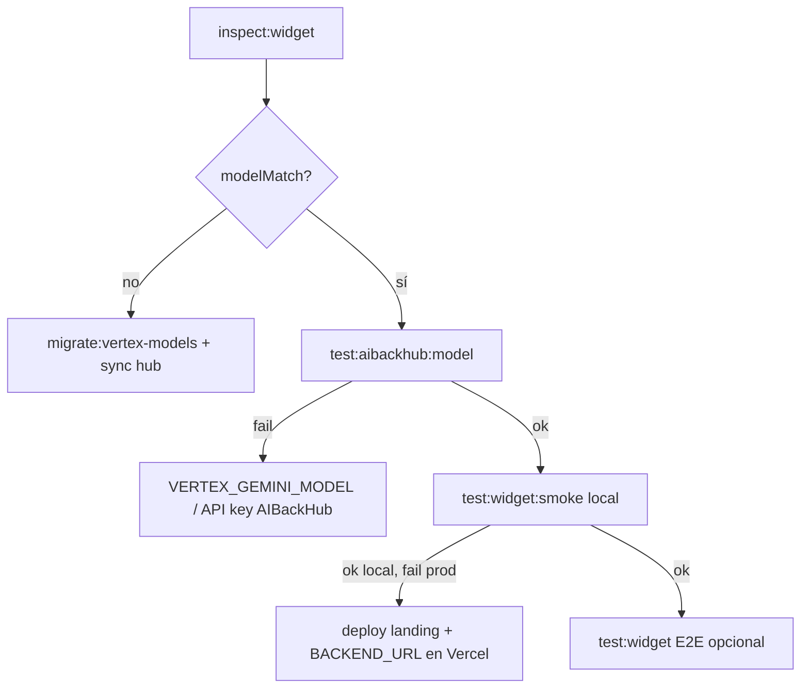

# Pruebas del widget embebido

Guía para reproducir diagnósticos de chat del SDK (`widget.js`) en local o producción.

## Widget de referencia

| Campo | Valor |
|-------|-------|
| Widget ID | `6a03a54c4f69fa7fa9027170` (MatIAs Auto Sales Hub) |
| Agente landing | `69d5084c78e0af3d5536fe95` |
| Hub agent ID | `ventas` |
| Modelo | `vx/gemini-3.1-pro-preview` |

---

## Prerrequisitos

1. **MongoDB** — `MONGODB_URI` apuntando a **`agentflowhub_landing`** (token `afhubToken` del widget).
2. **Local completo** — para smoke local:
   - AIBackHub en `:9003` (`cd ../AIBackHub && npm run dev`)
   - Landing en `:3201` (`npm run dev`)
   - `.env` con `BACKEND_URL=http://127.0.0.1:9003`
3. **Producción** — `BASE_URL=https://botiva.space`.

Copia variables desde `.env.example` si hace falta.

---

## Scripts disponibles

| Comando | Qué prueba |
|---------|------------|
| `npm run test:widget:smoke` | JSON + SSE rápido (≈30 s) |
| `npm run test:widget` | Suite E2E completa (22 casos) |
| `npm run test:aibackhub:model` | AIBackHub `/api/models` directo (sin landing) |
| `npm run inspect:widget -- <id>` | Estado Mongo widget + agente + hub |

Archivos en `scripts/`:

- `widget-chat-smoke.mjs` — smoke JSON + stream
- `widget-chat-test.mjs` — E2E exhaustivo
- `test-aibackhub-model.mjs` — motor IA aislado
- `inspect-widget.mjs` — inspección Mongo
- `lib/load-env.mjs` — helper compartido de `.env`

---

## 1. Smoke rápido (recomendado primero)

Comprueba que la landing responde con un mensaje real.

### Local

```powershell
cd agent-flow-landing

# Terminal 1: AIBackHub
cd ..\AIBackHub
npm run dev

# Terminal 2: landing
cd agent-flow-landing
npm run dev

# Terminal 3: smoke
npm run test:widget:smoke
```

### Producción

```powershell
cd agent-flow-landing
$env:BASE_URL = "https://botiva.space"
npm run test:widget:smoke
```

Variables útiles:

```powershell
$env:MESSAGE = "Hola, recomiéndame un SUV familiar"
$env:STREAM = "0"          # solo JSON, sin SSE
$env:WIDGET_ID = "6a03a54c4f69fa7fa9027170"
$env:WIDGET_TOKEN = "wt_…" # opcional si no hay Mongo
```

Salida esperada:

```
✅ JSON OK
✅ STREAM OK
✅ Smoke completado.
```

Si falla, revisar `code`, `details` y [widget-troubleshooting.md](./widget-troubleshooting.md).

---

## 2. Probar solo AIBackHub (aislar el motor)

Útil cuando la landing falla pero quieres saber si el modelo Vertex responde.

```powershell
cd agent-flow-landing
npm run test:aibackhub:model
```

Con modelo concreto:

```powershell
$env:MODEL = "gemini-3.1-pro-preview"
$env:PROVIDER = "vertex"
$env:BACKEND_URL = "http://127.0.0.1:9003"
npm run test:aibackhub:model
```

AIBackHub debe estar en marcha. Revisa en `.env` de AIBackHub:

- `VERTEX_GEMINI_API_KEY`
- `VERTEX_GEMINI_MODEL=gemini-2.5-flash` (no previews retirados)
- `MCP_ORCHESTRATOR_MODEL=gemini-2.5-flash`

---

## 3. Suite E2E completa

```powershell
cd agent-flow-landing
$env:BASE_URL = "https://botiva.space"
$env:MONGODB_URI = "mongodb+srv://…/agentflowhub_landing"
npm run test:widget
```

Incluye: seguridad, chat básico, SSE, RAG, sub-agentes, multi-turno, webhook.

**Nota:** algunos casos requieren AgentFlowhub levantado o webhook de prueba; en local con inferencia directa pueden fallar secciones que dependen del hub admin.

---

## 4. Inspección Mongo

```powershell
npm run inspect:widget -- 6a03a54c4f69fa7fa9027170
```

Verifica `modelMatch`, `afhubToken`, catálogo y bases (`agentflowhub_landing` / `agentflow`).

---

## 5. curl manual (sin scripts)

Token desde Mongo o dashboard. PowerShell:

```powershell
$body = @{
  agentId = "69d5084c78e0af3d5536fe95"
  message = "hola"
  token = "wt_TU_TOKEN"
  widgetId = "6a03a54c4f69fa7fa9027170"
  sessionId = "manual_1"
} | ConvertTo-Json -Compress

Invoke-RestMethod -Uri "https://botiva.space/api/widget/chat" `
  -Method POST -ContentType "application/json" -Body $body
```

Lee siempre **`details`** además de `error` / `code`.

---

## Orden de diagnóstico recomendado



---

## Errores frecuentes en tests

| Síntoma | Causa probable |
|---------|----------------|
| `WIDGET_CHAT_FAILED` + `flash-lite-preview` | AIBackHub prod con modelo obsoleto; deploy landing con inferencia directa o fix env |
| `HUB_CHAT_PROXY_FAILED` | AgentFlowhub no accesible desde landing |
| `ECONNREFUSED :9003` | AIBackHub no arrancado (smoke local) |
| Stream `Controller is already closed` | Bug en route SSE (no debería ocurrir tras fix) |
| Smoke JSON OK, STREAM FAIL | Revisar `/api/widget/chat/stream` y logs Next |

---

## Relacionado

- [widget-troubleshooting.md](./widget-troubleshooting.md) — causas y checklist prod
- [../README.md](../README.md) — scripts npm del proyecto
